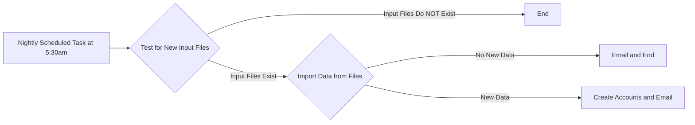

# Document Title

The document title should focus on the general content of the document. For example: "Creating User Accounts in LDAP". Provide a summary of the overall document content just after the title.

## Document Section

The document should be broken up into logical sections. Each section should then contain step-by-step or checklist instructions.

For example, one section may be called "Adding a New User"

### Step-By-Step or Checklist Subsection

Each section should contain step-by-step instructions and/or a checklist of how to perform each action under the appropriate section. Include examples and images as needed.

1.  Verify user names meet convention requirements *(1)*.
2.  From the command prompt, add the user to Ubuntu OpenLDAP Server: 

`sudo ldapadduser eggsham domainname`

* [ ] User added to Ubuntu OpenLDAP Server

Add visual aids if necessary.

## Reference

The reference area should be used to add any additional information or instructions on how to deal with more specific circumstances, and/or to reference any external sources of information.

(1) **Section Title: Subtitle** - Do not include hyphens (-) in user account names.

"OpenLDAP Server: User and Group Management." Ubuntu, 8 Nov. 2016, [https://help.ubuntu.com/lts/serverguide/openldap-server.html](https://help.ubuntu.com/lts/serverguide/openldap-server.html).
